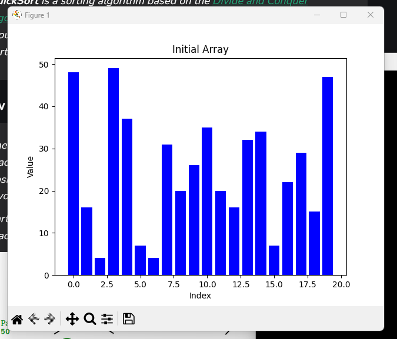
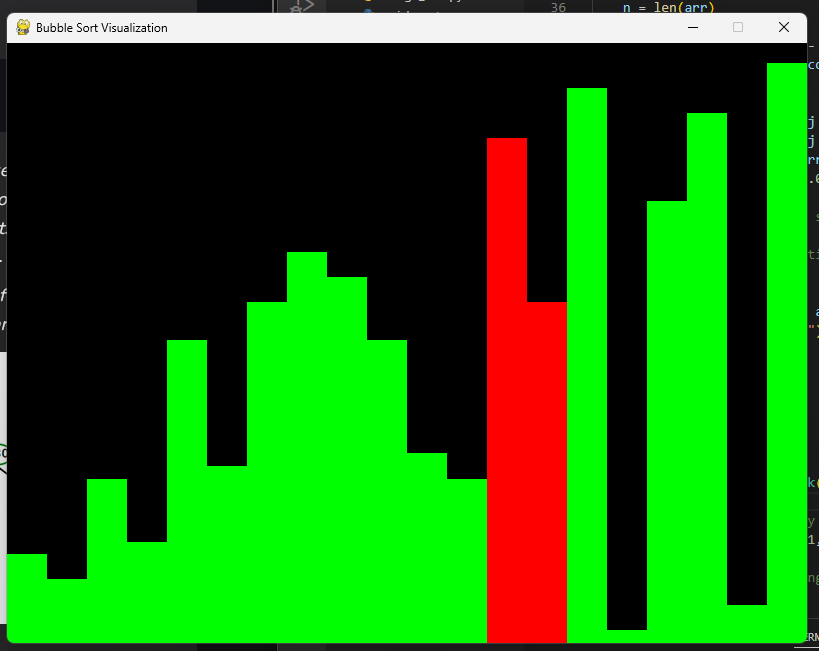
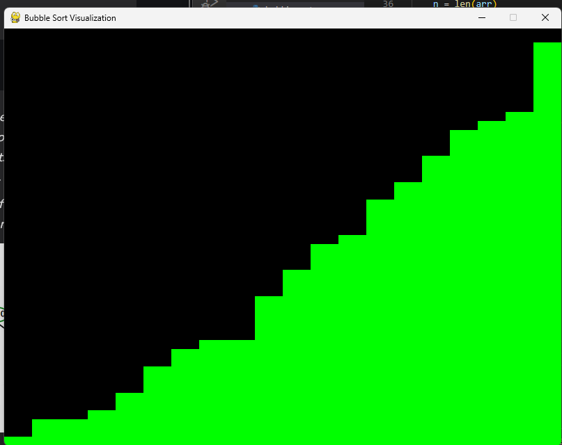

# Sorting Algorithms Visualized 

A Sorting Algorithm is used to rearrange a given array or list of elements according to a comparison operator on the elements. 

1. **Selection sort** is a simple and efficient sorting algorithm that works by repeatedly selecting the smallest (or largest) element from the unsorted portion of the list and moving it to the sorted portion of the list. 

2. **Bubble Sort** is the simplest sorting algorithm that works by repeatedly swapping the adjacent elements if they are in the wrong order. This algorithm is not suitable for large data sets as its average and worst-case time complexity is quite high.
3. **Heap sort** is a comparison-based sorting technique based on Binary Heap data structure. It is similar to the selection sort where we first find the minimum element and place the minimum element at the beginning. Repeat the same process for the remaining elements. 
4. **QuickSort** is a sorting algorithm based on the Divide and Conquer algorithm that picks an element as a pivot and partitions the given array around the picked pivot by placing the pivot in its correct position in the sorted array.
5. **Insertion sort** is a simple sorting algorithm that works by iteratively inserting each element of an unsorted list into its correct position in a sorted portion of the list. It is a stable sorting algorithm, meaning that elements with equal values maintain their relative order in the sorted output. 

## Results from comparison.ipynb for list of 5000 number 
1. Selection Sort: 0.805348 seconds
2. Bubble Sort: 1.420001 seconds
3. Heap Sort: 0.013520 seconds
4. Quick Sort: 0.004126 seconds
5. Insertion Sort: 0.799952 seconds

## Images :

Bubble Sort :
Inital array -> bubble_sort -> final array

- 
- 
- 

** Note :

TODO:
- Only bubble and insertion sort are using **utils**.
- Need to update rest of the code to work with utils
- Code is buugy as in pygame crashes if sorting is interrupted by any activity by user. 